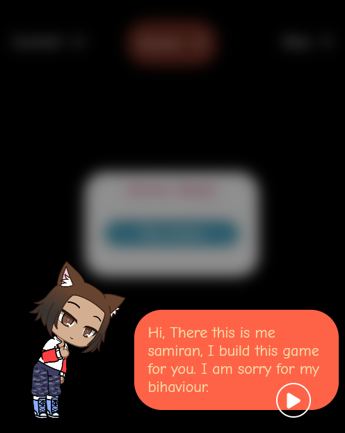

# Color Shooter Game for Soma 🌈🎮

🎉 Welcome to the Color Shooter Game created with love for Soma! 🚀 Experience the thrill of shooting colorful balls in this mobile-friendly game designed to bring joy and excitement.

<!--  -->

## Table of Contents

- [Introduction](#introduction)
- [How to Play](#how-to-play)
- [Demo](#demo)
- [Contribution](#contribution)
- [License](#license)

## Introduction

The Color Shooter Game for Soma is a mobile game crafted with love and fun in mind. Dive into a world of vibrant colors where you become the shooter, tasked with hitting colorful balls that come towards you. It's an engaging and visually stunning experience, perfect for moments of leisure and joy.

## How to Play

1. Open the game on your mobile device: [Color Shooter Game for Soma](https://samiran005.github.io/Game_for_Soma/).
2. Tap to the shooter.
3. Release to shoot colorful balls.
4. Hit as many balls as you can to score points.
5. Enjoy the dynamic and captivating gameplay!

## Demo

Check out the live demo of the Color Shooter Game [here](https://samiran005.github.io/Game_for_Soma/).

## Contribution

While this game is a personal creation, your feedback is always welcome! If you have ideas for improvements, new features, or if you find any issues, feel free to share your thoughts. Let's make this game even more enjoyable together.

## License

This project is licensed under the [MIT License](./LICENSE). Feel free to share the game and spread the joy!

---

Have a blast with the Color Shooter Game for Soma! 🌟🌈🎯